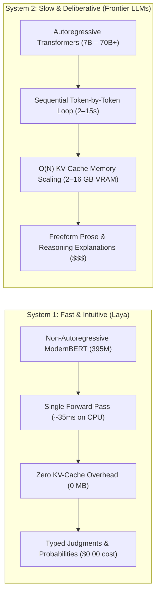
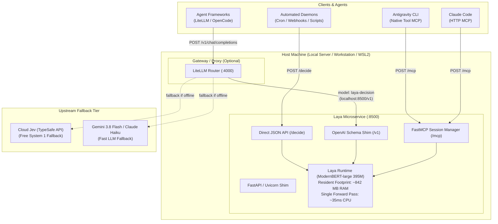
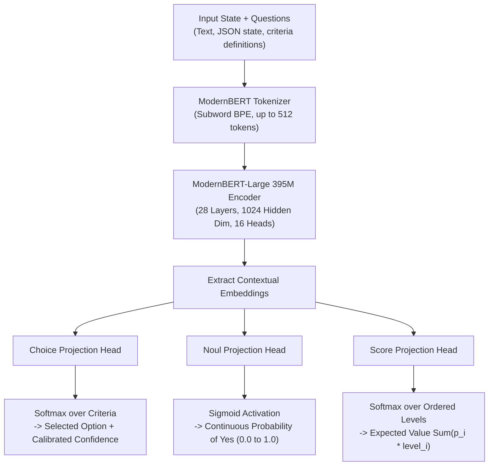
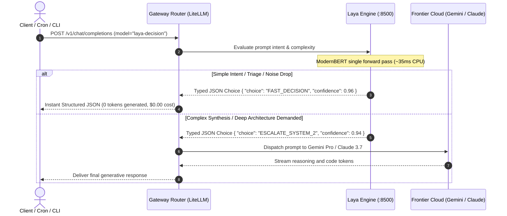
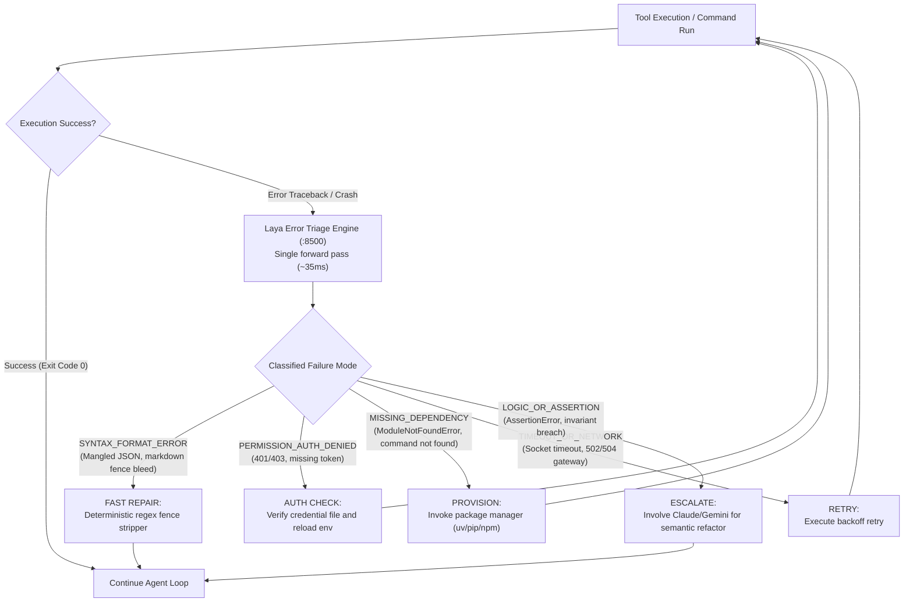
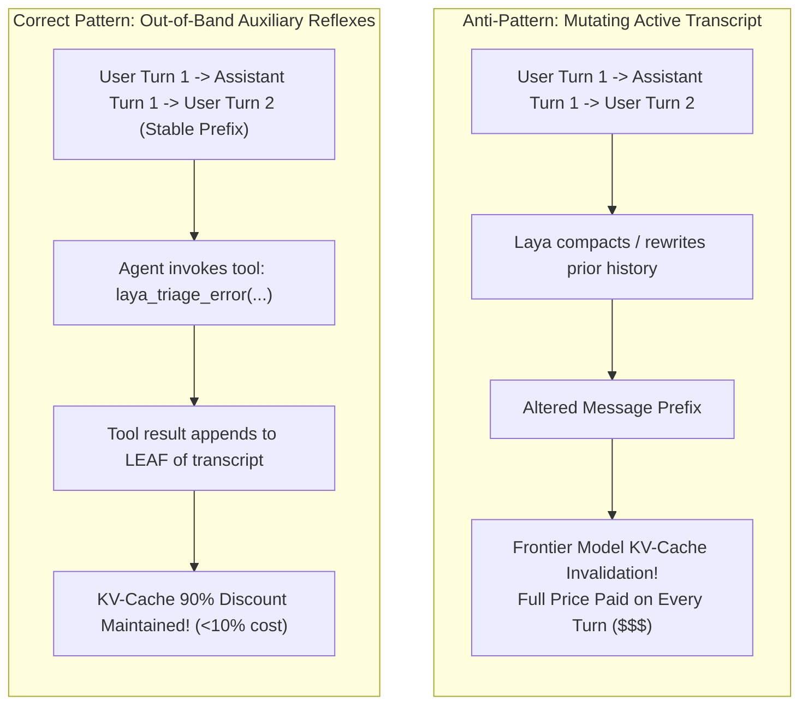

# Architecture: Non-Autoregressive "System 1" Decision Engine

This document specifies the technical architecture, internal mechanics, hardware accounting, and integration topologies for **Laya**—a local, non-autoregressive "System 1" decision engine.

---

## 1. Conceptual Framework: System 1 vs. System 2

Daniel Kahneman's dual-process cognitive framework (*Thinking, Fast and Slow*) distinguishes between two modes of thought:

Traditional software architectures frequently waste System 2 capacity on problems that only require System 1 judgment:
* *Classifying an incoming email as an invoice vs. newsletter.*
* *Routing a user prompt to a fast agent vs. a deep planner.*
* *Triaging a shell traceback to identify the failing component.*
* *Scoring the severity of a production metric anomaly.*

Laya offloads these semantic classification and routing tasks to a local CPU microservice, reserving System 2 models for multi-step reasoning, architectural synthesis, and code generation.

---

## 2. System Topology & Deployment Architecture

Laya operates as an always-on background daemon exposing three interface contracts:
1. **Model Context Protocol (MCP)**: FastMCP Streamable HTTP (`/mcp`) for direct integration into interactive agent loops (Claude Code, Antigravity CLI).
2. **OpenAI Chat Completions (`/v1/chat/completions`)**: Emulates an OpenAI-compatible completion endpoint for gateway routers (LiteLLM, OpenCode).
3. **Direct JSON REST API (`/decide`, `/health`)**: Low-latency endpoints for cron pipelines, shell scripts, and webhook listeners.

---

## 3. Internal Model Mechanics: Non-Autoregressive Heads

Unlike generative LLMs that predict the next token $\Pr(w_t \mid w_{<t})$ in an iterative loop, Laya processes input text in a **single bidirectional forward pass** over a ModernBERT backbone, extracting dense token representations that feed dedicated classification heads:

### The Three Native Primitives

| Primitive | Output Schema | Mathematical Activation | Primary Use Case |
| :--- | :--- | :--- | :--- |
| **`Choice`** | `{"choice": str, "confidence": float, "probabilities": dict}` | $\text{Softmax}(z_{\text{criteria}})$ | Mutually exclusive categorical routing (e.g. `[AUTH, DB, NETWORK]`). |
| **`Noul`** | `{"yes_probability": float, "confidence": float}` | $\sigma(z_{\text{affirmative}})$ | Continuous probability of a condition holding true without competing alternatives. |
| **`Score`** | `{"expected_score": float, "probabilities": dict, "legend": dict}` | $\sum_{i=1}^K i \cdot \Pr(\text{level}_i)$ | Position on an ordered semantic ladder (e.g. Incident Severity `1` to `4`). |

---

## 4. Hardware Resource Footprint & Accounting

Because Laya does not perform autoregressive generation, its computational profile differs fundamentally from generative LLMs:

| Metric | Local Generative LLM (Qwen 35B / Llama 70B) | Small Generative SLM (Qwen 7B / Phi-3) | Laya System 1 (ModernBERT 395M) |
| :--- | :--- | :--- | :--- |
| **Parameters** | 35B – 70B | 3.8B – 7B | **395M** (+ 26M decision transformer head) |
| **Precision** | 4-bit / 8-bit quantized | 4-bit / 8-bit quantized | **FP16 Native** (Unquantized) |
| **Resident RAM (Disk/RAM)** | 20 GB – 42 GB | 4.5 GB – 8 GB | **~842 MB** (Fits comfortably on any device) |
| **Peak Inference Memory** | Model Size + KV Cache ($O(N)$) | Model Size + KV Cache ($O(N)$) | **~1.8 GB RSS** ($O(1)$ constant overhead) |
| **KV-Cache Allocation** | 2 GB – 12 GB VRAM | 500 MB – 2 GB VRAM | **0 MB** (Non-autoregressive, stateless) |
| **Hardware Requirement** | Dedicated GPU (16GB–48GB VRAM) | Mid-range GPU or slow CPU | **Standard x86/ARM CPU** (0 GPU required) |
| **Single Forward Pass Latency** | 3,000 – 15,000 ms (serial streaming) | 800 – 3,000 ms | **~25 – 45 ms** |
| **Thermal / Power Impact** | 100W – 350W sustained | 45W – 100W sustained | **2W – 10W** (Brief single-core burst) |

---

## 5. Architectural Dataflows

### Dataflow A: Ingress Reflex Router (Fast Path)

### Dataflow B: Execution Error Triage & Fast Recovery

---

## 6. The Prompt Cache Preservation Principle (Teknium's Law)

A critical architectural consideration when integrating System 1 models into agentic loops is **Prompt Cache Preservation**:

### Core Rule
* **Never use Laya to rewrite, compress, or alter existing chat history turns.** Changing even a single token in the conversation prefix breaks the KV cache of upstream frontier models (Anthropic, Google).
* **Always use Laya out-of-band**: inside tool calls, pre-ingress filters, post-egress validators, or standalone cron scripts. Because tool call responses append strictly to the *end* of the prompt, the entire preceding KV cache remains warm and valid.
